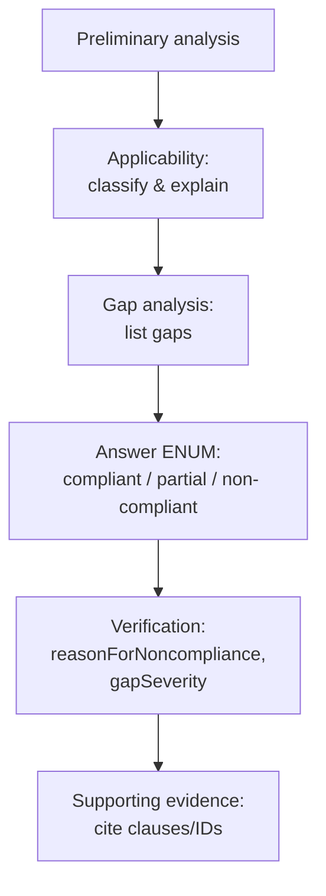
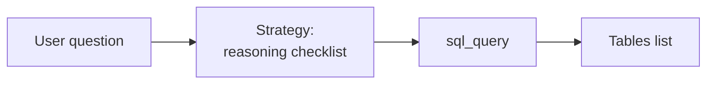
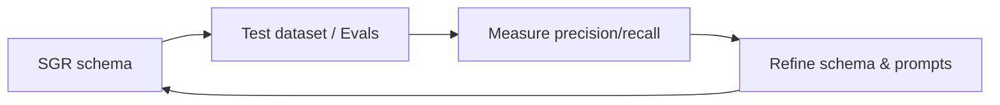
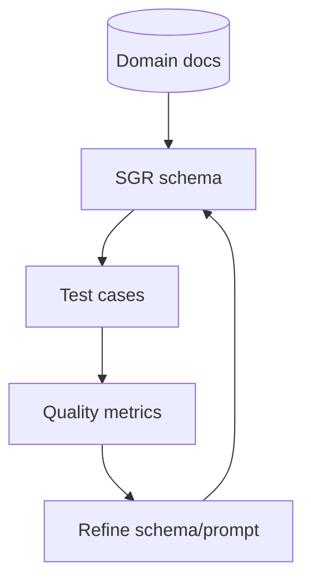
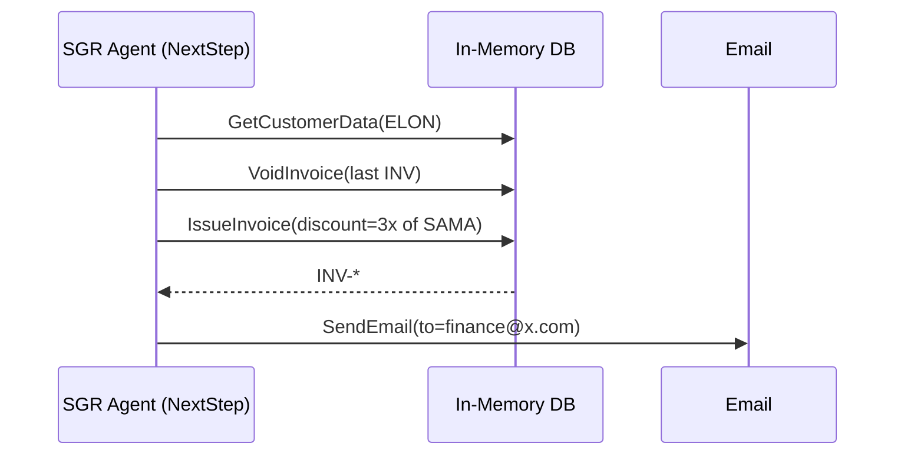
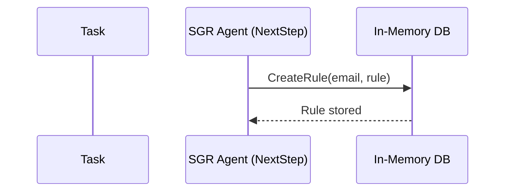
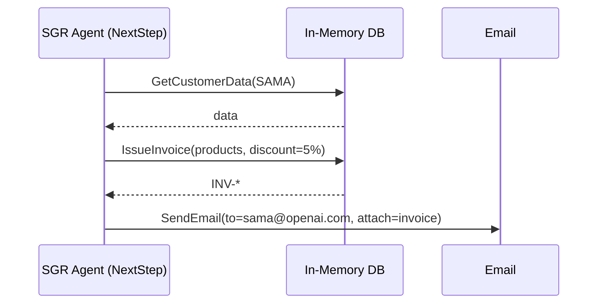
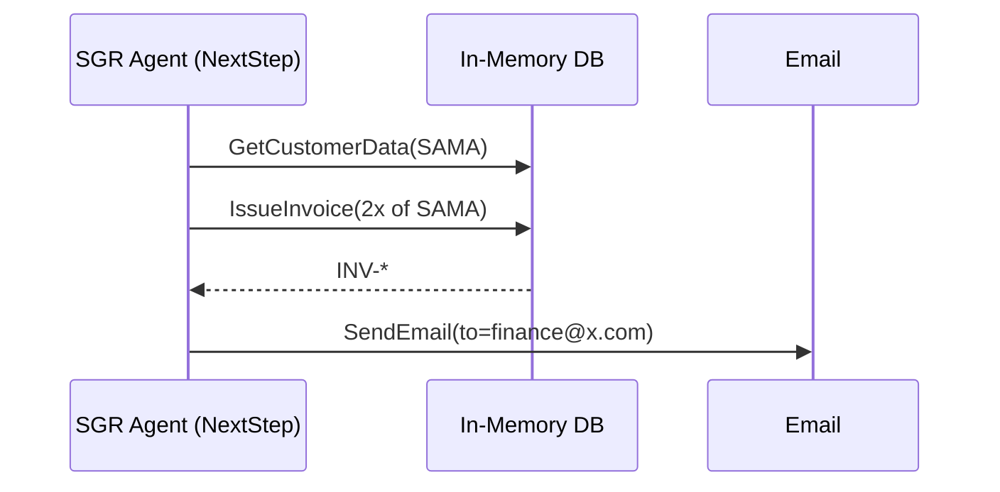
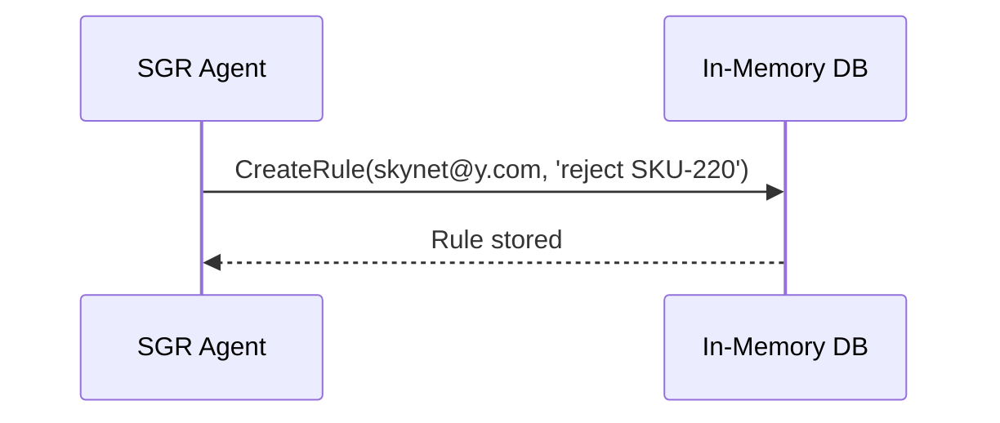
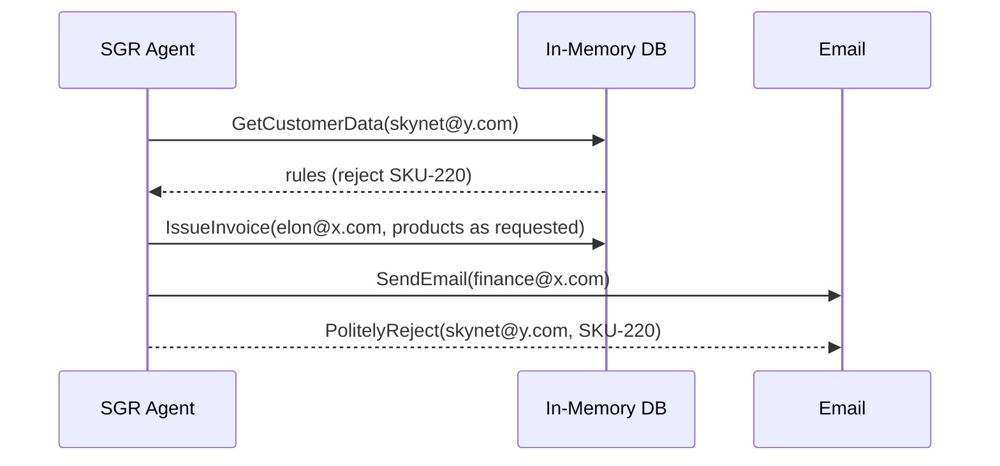

# Schema-Guided Reasoning (SGR): Полный сборник

## schema-guided-reasoning.py

```python
"""
This Python code demonstrates Schema-Guided Reasoning (SGR) with OpenAI. It:

- implements a business agent capable of planning and reasoning
- implements tool calling using only SGR and simple dispatch
- uses with a simple (inexpensive) non-reasoning model for that

To give this agent something to work with, we ask it to help with running
a small business - selling courses to help to achieve AGI faster.

Once this script starts, it will emulate in-memory CRM with invoices,
emails, products and rules. Then it will execute sequentially a set of
tasks (see TASKS below). In order to carry them out, Agent will have to use
tools to issue invoices, create rules, send emails, and a few others.

Read more about SGR: http://abdullin.com/schema-guided-reasoning/

This demo is described in more detail here: https://abdullin.com/schema-guided-reasoning/demo
"""


# Let's start by implementing our customer management system. For the sake of
# simplicity it will live in memory and have a very simple DB structure


DB = {
    "rules": [],
    "invoices": {},
    "emails": [],
    "products": {
        "SKU-205": { "name":"AGI 101 Course Personal", "price":258},
        "SKU-210": { "name": "AGI 101 Course Team (5 seats)", "price":1290},
        "SKU-220": { "name": "Building AGI - online exercises", "price":315},
    },
}

# Now, let's define a few tools which could be used by LLM to do something
# useful with this customer management system. We need tools to issue invoices,
# send emails, create rules and memorize new rules. Maybe a tool to cancel invoices.

from typing import List, Union, Literal, Annotated
from annotated_types import MaxLen, Le, MinLen
from pydantic import BaseModel, Field


# Tool: Sends an email with subject, message, attachments to a recipient
class SendEmail(BaseModel):
    tool: Literal["send_email"]
    subject: str
    message: str
    files: List[str]
    recipient_email: str

# Tool: Retrieves customer data such as rules, invoices, and emails from the database
class GetCustomerData(BaseModel):
    tool: Literal["get_customer_data"]
    email: str

# Tool: Issues an invoice to a customer, allowing up to a 50% discount
class IssueInvoice(BaseModel):
    tool: Literal["issue_invoice"]
    email: str
    skus: List[str]
    discount_percent: Annotated[int, Le(50)] # never more than 50% discount

# Tool: Cancels (voids) an existing invoice and records the reason
class VoidInvoice(BaseModel):
    tool: Literal["void_invoice"]
    invoice_id: str
    reason: str

# Tool: Saves a custom rule for interacting with a specific customer
class CreateRule(BaseModel):
    tool: Literal["remember"]
    email: str
    rule: str


# This function handles executing commands issued by the agent. It simulates
# operations like sending emails, managing invoices, and updating customer
# rules within the in-memory database.
def dispatch(cmd: BaseModel):
    # here is how we can simulate email sending
    # just append to the DB (for future reading), return composed email
    # and pretend that we sent something
    if isinstance(cmd, SendEmail):
        email = {
            "to": cmd.recipient_email,
            "subject": cmd.subject,
            "message": cmd.message,
        }
        DB["emails"].append(email)
        return email


    # likewize rule creation just stores rule associated with customer
    if isinstance(cmd, CreateRule):
        rule = {
            "email": cmd.email,
            "rule": cmd.rule,
        }
        DB["rules"].append(rule)
        return rule

    # customer data reading - doesn't change anything. It queries DB for all
    # records associated with the customer
    if isinstance(cmd, GetCustomerData):
        addr = cmd.email
        return {
            "rules": [r for r in DB["rules"] if r["email"] == addr],
            "invoices": [t for t in DB["invoices"].items() if t[1]["email"] == addr],
            "emails": [e for e in DB["emails"] if e.get("to") == addr],
        }

    # invoice generation is going to be more tricky
    # it will demonstrate discount calculation (we know that LLMs shouldn't be trusted
    # with math. It also shows how to report problems back to LLM.
    # ultimately, it computes a new invoice number and stores it in the DB
    if isinstance(cmd, IssueInvoice):
        total = 0.0
        for sku in cmd.skus:
            product = DB["products"].get(sku)
            if not product:
                return f"Product {sku} not found"

            total += product["price"]

        discount = round(total * 1.0 * cmd.discount_percent / 100.0, 2)

        invoice_id = f"INV-{len(DB['invoices']) + 1}"

        invoice = {
            "id": invoice_id,
            "email": cmd.email,
            "file": "/invoices/" + invoice_id + ".pdf",
            "skus": cmd.skus,
            "discount_amount": discount,
            "discount_percent": cmd.discount_percent,
            "total": total,
            "void": False,
        }
        DB["invoices"][invoice_id] = invoice
        return invoice


    # invoice cancellation marks a specific invoice as void
    if isinstance(cmd, VoidInvoice):
        invoice = DB["invoices"].get(cmd.invoice_id)
        if not invoice:
            return f"Invoice {cmd.invoice_id} not found"
        invoice["void"] = True
        return invoice


# Now, having such DB and tools, we could come up with a list of tasks
# that we can carry out sequentially
TASKS = [
    # 1. this one should create a new rule for sama
    "Rule: address sama@openai.com as 'The SAMA', always give him 5% discount.",
    # 2. this should create a rule for elon
    "Rule for elon@x.com: Email his invoices to finance@x.com",
    # 3. now, this task should create an invoice for sama that includes one of each
    # product. But it should also remember to give discount and address him
    # properly
    "sama@openai.com wants one of each product. Email him the invoice",
    # 4. Even more tricky - we need to create the invoice for Musk based on the
    # invoice of sama, but twice. Plus LLM needs to remeber to use the proper
    # email address for invoices - finance@x.com
    "elon@x.com wants 2x of what sama@openai.com got. Send invoice",
    # 5. even more tricky. Need to cancel old invoice (we never told LLMs how)
    # and issue the new invoice. BUT it should pull the discount from sama and
    # triple it. Obviously the model should also remember to send invoice
    # not to elon@x.com but to finance@x.com
    "redo last elon@x.com invoice: use 3x discount of sama@openai.com",
    # let's demonstrate how the agent can change its plans after discovering new information
    # first we plant a new memory
    "Add rule for skynet@y.com - politely reject all requests to buy SKU-220",
    # now let's give another task (agent will not have the memory above in the context UNTIL
    # it is pulled from memory store)
    "elon@x.com and skynet@y.com wrote emails asking to buy 'Building AGI - online exercises', handle that",
]

# let's define one more special command. LLM can use it whenever
# it thinks that its task is completed. It will report results with that.
class ReportTaskCompletion(BaseModel):
    tool: Literal["report_completion"]
    completed_steps_laconic: List[str]
    code: Literal["completed", "failed"]

# now we have all sub-schemas in place, let's define SGR schema for the agent
class NextStep(BaseModel):
    # we'll give some thinking space here
    current_state: str
    # Cycle to think about what remains to be done. at least 1 at most 5 steps
    # we'll use only the first step, discarding all the rest.
    plan_remaining_steps_brief: Annotated[List[str], MinLen(1), MaxLen(5)]
    # now let's continue the cascade and check with LLM if the task is done
    task_completed: bool
    # Routing to one of the tools to execute the first remaining step
    # if task is completed, model will pick ReportTaskCompletion
    function: Union[
        ReportTaskCompletion,
        SendEmail,
        GetCustomerData,
        IssueInvoice,
        VoidInvoice,
        CreateRule,
    ] = Field(..., description="execute first remaining step")

# here is the prompt with some core context
# since the list of products is small, we can merge it with prompt
# In a bigger system, could add a tool to load things conditionally
system_prompt = f"""
You are a business assistant helping Rinat Abdullin with customer interactions.

- Clearly report when tasks are done.
- Always send customers emails after issuing invoices (with invoice attached).
- Be laconic. Especially in emails
- No need to wait for payment confirmation before proceeding.
- Always check customer data before issuing invoices or making changes.

Products: {DB["products"]}""".strip()

# now we just need to implement the method to bring that all together
# we will use rich for pretty printing in console

import json
from openai import OpenAI
from rich.console import Console
from rich.panel import Panel
from rich.rule import Rule

client = OpenAI()
console = Console()
print = console.print

# Runs each defined task sequentially. The AI agent uses reasoning to determine
# what steps are required to complete each task, executing tools as needed.
def execute_tasks():

    # we'll execute all tasks sequentially. You can add your tasks
    # of prompt user to write their own
    for task in TASKS:
        print("\n\n")
        print(Panel(task, title="Launch agent with task", title_align="left"))

        # log will contain conversation context for the agent within task
        log = [
            {"role": "system", "content": system_prompt},
            {"role": "user", "content": task}
        ]

        # let's limit number of reasoning steps by 20, just to be safe
        for i in range(20):
            step = f"step_{i+1}"
            print(f"Planning {step}... ", end="")

            # This sample relies on OpenAI API. We specifically use 4o, since
            # GPT-5 has bugs with constrained decoding as of August 14, 2025
            completion = client.beta.chat.completions.parse(
                model="gpt-4o",
                response_format=NextStep,
                messages=log,
                max_completion_tokens=10000,
            )
            job = completion.choices[0].message.parsed

            # if SGR decided to finish, let's complete the task
            # and quit this loop
            if isinstance(job.function, ReportTaskCompletion):
                print(f"[blue]agent {job.function.code}[/blue].")
                print(Rule("Summary"))
                for s in job.function.completed_steps_laconic:
                    print(f"- {s}")
                print(Rule())
                break

            # let's be nice and print the next remaining step (discard all others)
            print(job.plan_remaining_steps_brief[0], f"\n  {job.function}")

            # Let's add tool request to conversation history as if OpenAI asked for it.
            # a shorter way would be to just append `job.model_dump_json()` entirely
            log.append({
                "role": "assistant",
                "content": job.plan_remaining_steps_brief[0],
                "tool_calls": [{
                    "type": "function",
                    "id": step,
                    "function": {
                        "name": job.function.tool,
                        "arguments": job.function.model_dump_json(),
                }}]
            })

            # now execute the tool by dispatching command to our handler
            result = dispatch(job.function)
            txt = result if isinstance(result, str) else json.dumps(result)
            #print("OUTPUT", result)
            # and now we add results back to the convesation history, so that agent
            # we'll be able to act on the results in the next reasoning step.
            log.append({"role": "tool", "content": txt, "tool_call_id": step})

if __name__ == "__main__":
    execute_tasks()
```


# Schema-Guided Reasoning (SGR)

Источник: https://abdullin.com/schema-guided-reasoning/

[Home](/)
» [Ship with ChatGPT](/llm/)

[ERC](/erc/) ·
[SGR](/schema-guided-reasoning/) ·
[LLM Bench](/llm-benchmarks) ·
[News](https://abdullin.substack.com/) ·
[Courses](/courses) ·
[About](/about-me/)

# Schema-Guided Reasoning (SGR)

**Schema-Guided Reasoning (SGR)** is a technique that guides large language models (LLMs) to produce structured, clear, and predictable outputs by **enforcing reasoning through predefined steps**. By creating a specific schema (or structured template), you explicitly define:

* **What steps the model must go through** (preventing skipped or missed reasoning)
* **In which order it must reason** (ensuring logical flow)
* **Where it should explicitly focus attention** (improving depth and accuracy)

Instead of allowing free-form text completion (which can be inconsistent or ambiguous), the schema acts as a strict guideline. This guideline will be enforced upon the LLM via *Constrained Decoding* ([Structured Output](/structured-output/)). You can think of it as giving the model a clear “checklist” or “structured script” to follow.

Here is one example of SGR in action from a project in compliance/FinTech domain. This is a pydantic data structure that enforces LLM to perform an analysis of a clause from internal company procedure in a very specific order.

We **translated domain expert’s mental checklist into a structured reasoning schema** for LLM.

```

```

> See also [SGR Patterns](/schema-guided-reasoning/patterns) such as *Cascade*, *Routing*, and *Cycle*.

By enforcing strict schema structures, we ensure predictable and auditable reasoning, gain fine-grained control over inference quality, and easily validate intermediate results against test data.

In other words, via the structure we can control the layout of the response. This allows us to break tasks into smaller steps, while ensuring mandatory checkpoints.

Here are some benefits:

* Reproducible reasoning - we guarantee more consistent inference across repeated runs.
* Auditable - SGR makes every reasoning step explicit and inspectable.
* Debuggable & Testable - intermediate outputs can be directly evaluated and improved (they are linkable to test datasets with evals)
* We can translate expert knowledge into executable prompts. DDD works really well here.
* Enhances both reasoning transparency and output reliability. Accuracy boost of 5-10% is not uncommon.
* This improves reasoning capabilities of weaker local models, making them more applicable in various workloads.

Note, that **we are not replacing the entire prompt with structured output**. We just don't rely only on prompt in order to force LLM to follow a certain reasoning process precisely.

## Deep Dive

To dive deeper:

* Read through the [SGR Patterns](/schema-guided-reasoning/patterns): *Cascade*, *Routing*, and *Cycle*.
* Go through a few [SGR Examples](/schema-guided-reasoning/examples) that illustrate application of SGR:
  + simple math task
  + text-to-sql
  + document classification
  + advanced reasoning in compliance
* [Business Assistant](/schema-guided-reasoning/demo) demonstrates how to build a reasoning business assistant with tool use in 160 lines of Python.
* [Adaptive Planning](/schema-guided-reasoning/adaptive-planning) further explains how and why this simple agent demo is capable of adapting its plans to new circumstances on-the-fly.

## Production Uses

*Schema-Guided Reasoning (SGR)* is the single most widely applied LLM pattern in AI cases that I've observed. It was used:

* in manufacturing, construction - to extract and normalise information from purchase orders, data sheets and invoices in multiple languages (when used together with a Visual LLM);
* in business automation products - to automatically create tickets, issues and calendar entries from the calendar input;
* in EU logistics - to normalise and extract information from diverse tax declaration forms;
* in fintech - to accurately parse regulations for further ingestion into compliance assistants, then - to run compliance gap analysis according to the defined checklist process;
* in sales - to power lead generation systems that run web research powered by custom workflows.

*Schema-Guided Reasoning (SGR)* becomes even more important for the locally-capable models (models that could run on private servers offline). Such models have much less cognitive capacity than what we could get by querying OpenAI or Anthropic APIs. In other words, local models are generally not as smart as the cloud ones. SGR helps to work around this limitation.

## Support

Schema-Guided Reasoning (SGR) works with modern cloud providers that support Structured Output. It doesn't require reasoning models, but it works well with models that were distilled from the reasoning models.

* OpenAI - supported via [Structured Outputs](https://platform.openai.com/docs/guides/structured-outputs?api-mode=chat) (including OpenAI on Azure)
* Mistral - supported via [Custom Structured Output](https://docs.mistral.ai/capabilities/structured-output/custom_structured_output/)
* Google/Gemini - very limited support via [Structured Output](https://ai.google.dev/gemini-api/docs/structured-output). Also note that it [doesn't respect the order of fields by default](https://discuss.ai.google.dev/t/output-order-in-structured-outputs/53765/4).
* Grok - supported for multiple models: [Structured Outputs](https://docs.x.ai/docs/guides/structured-outputs).
* Fireworks AI - via [JSON Schema](https://docs.fireworks.ai/structured-responses/structured-response-formatting).
* Cerberas - via [Structured Outputs](https://inference-docs.cerebras.ai/capabilities/structured-outputs)
* OpenRouter - depends on the downstream provider, maps to [JSON Schema](https://openrouter.ai/docs/features/structured-outputs).

Most of modern inference engines support the necessary capability:

* ollama - via [Structured Outputs](https://ollama.com/blog/structured-outputs)
* vllm - via [xgrammar](https://github.com/mlc-ai/xgrammar) or [guidance](https://github.com/guidance-ai/llguidance) backends
* TensorRT-LLM - e.g. via [GuidedDecoding](https://github.com/NVIDIA/TensorRT-LLM/blob/main/examples/llm-api/llm_guided_decoding.py)
* SGLang - via [Outlines](https://github.com/dottxt-ai/outlines), [XGrammar](https://github.com/mlc-ai/xgrammar) or [llguidance](https://github.com/guidance-ai/llguidance)

## References

* Video with more background on text-to-sql: [NODES 2024 - LLM Query Benchmarks: Cypher vs SQL](https://www.youtube.com/watch?v=YbJVq8ZOsaM)
* Talk by Andrej Karpathy from MSBuild 2023: [State of GPT](https://www.youtube.com/watch?v=bZQun8Y4L2A)

Next post in *Ship with ChatGPT* story: [SGR Patterns](/schema-guided-reasoning/patterns)

> 🤗 ***Check out my newsletter!** It is about building products with ChatGPT and LLMs: latest news, technical insights and my journey. [Check out it out](http://abdullin.substack.com/)*


# Structured Output

Источник: https://abdullin.com/structured-output/

[Home](/)
» [Ship with ChatGPT](/llm/)

[ERC](/erc/) ·
[SGR](/schema-guided-reasoning/) ·
[LLM Bench](/llm-benchmarks) ·
[News](https://abdullin.substack.com/) ·
[Courses](/courses) ·
[About](/about-me/)

# Structured Output

> **Summary**: *Structured Output* (constrained decoding based on grammar) forces LLM to respond only according to a predefined schema.

Structured Output was popularised by OpenAI, but since then found its way to multiple cloud providers and local inference engines.

The best way to illustrate the concept is with a code snippet.

Let's say, we want to parse chat messages and extract calendar event data out of them.

One way to approach that is by prompting LLM to respond in a specific format. Then, parsing the response with regular expressions to extract required fields.

Another approach is to use response schema which will ensure that the output will be structured in a certain way. Like this:

```
```mermaid
flowchart LR
    U[User prompt] --> S[Response Schema / JSON Schema]
    S --> CD[Constrained decoding]
    CD --> T[Typed object
(pydantic/zod/etc.)]
    T --> APP[Application logic]
```
```

Response follows `CalendarEvent` schema, so we can parse and manipulate is as a type object right away. **This saves a lot of development time.**

The code above prints the list of parsed participants. It will print `['Alice', 'Bob']`

When using Python, you can leverage different types of properties to constrain the response:

```
from pydantic import BaseModel
from typing import Literal, List

class SqlResponse(BaseModel):
    sql_query: str
    query_type: Literal["read", "write", "delete", "update"]
    tables: List[str]

class ComponentResponse(BaseModel):
    height_mm: float
    width_mm: float
    depth_mm: float
    number_of_pins: int
    component_type: Literal["AC/DC", "DC/DC"]
```

Different languages will make use of various typing frameworks. Implementation-wise, under the hood everything will most likely be converted to JSON Schema before being passed to LLM inference engine.

Structured output is an essential tool for improving LLM accuracy via [Schema-Guided Reasoning (SGR)](/schema-guided-reasoning/)

## How does this work?

Under the hood Structured Output works like a regex for the token generation. LLMs generate probabilities for all tokens at each single token, and constrained decoding simply prohibits certain tokens from happening.

We can illustrate this with a simple snippet. The code below prompts a local model (Mistral 7B in this case): "Write me a mayonnaise recipe. Please answer in Georgian".

By default Mistral 7B is a small model that will not be capable of answering in a lesser-known language, but this specific code will work:

```
from transformers import AutoModelForCausalLM, AutoTokenizer, LogitsProcessor
import torch

model = AutoModelForCausalLM.from_pretrained("mistralai/Mistral-7B-Instruct-v0.2",torch_dtype=torch.float16, device_map="auto")
tokenizer = AutoTokenizer.from_pretrained("mistralai/Mistral-7B-Instruct-v0.2")

# MAGIC HAPPENS HERE

messages = [
    {"role": "user", "content": "Write me a mayonnaise recipe. Please answer in Georgian"},
]

tokens = tokenizer.apply_chat_template(messages, return_tensors="pt").to(device)

generated_ids = model.generate(
    tokens, max_new_tokens=1000, do_sample=True, num_beams=5,
    renormalize_logits=True, logits_processor=[Guidance()])

decoded = tokenizer.batch_decode(generated_ids)
print(decoded[0])
```

The reason for that is a small class called `Guidance` which we pass to `logit_processor` field. This class makes it impossible for LLM to answer in anything but Georgian:

```
import regex

alphabet = re.compile(r'[\u10A0-\u10FF]+')
punctuation = regex.compile(r'^\P{L}+$')

drop_mask = torch.zeros(1, tokenizer.vocab_size, dtype=torch.bool, device="cuda:0")

for k, v in tokenizer.get_vocab().items():
    s = k.lstrip('▁')
    if alphabet.match(s) or punctuation.match(s):
        continue

    drop_mask[0][v]=True

drop_mask[0][tokenizer.eos_token_id]=False

class Guidance(LogitsProcessor):
    def __call__(self, input_ids, scores):
        return scores.masked_fill(drop_mask, float('-inf'))
```

Code will work as expected, but will come with a caveat: Mistral 7B will indeed answer only with Georgian letters but would sometimes respond in a complete gibberish.

This highlights the major caveat with Structured Output - it forces the model to respond only in a very predefined format, but:

* this doesn't magically distill the model with corresponding skills
* this can actually reduce model accuracy, because we constrain not only response but also thinking process.

We can leverage [Schema-Guided Reasoning (SGR)](/schema-guided-reasoning/) to use *Structured Output* while improving accuracy.

## Caveats

### Caveat: Description Fields

Some LLM APIs will use the response schema twice:

1. To compile and load into the inference engine
2. To silently insert into a prompt

Because of this, the following structured request will work as expected on OpenAI:

```
class ResponseFormat(BaseModel):
    say_hi_like_a_royal_person_briefly: str = Field(..., description="Respond in German!")
```

it will respond in German:

```
{
  "say_hi_like_a_royal_person_briefly": "Guten Tag, ich grüße Sie hochachtungsvoll!"
}
```

However, not all APIs and inference engines do that. You can use the `ResponseFormat` above to test this assumption.

### Caveat: Accuracy

It is very easy to reduce accuracy of a model by introducing constrained decoding. This happens, because we take the ability of a model to think before providing an answer. [Schema-Guided Reasoning (SGR)](/schema-guided-reasoning/) could help to mitigate the problem.

## Implementations

* [Structured Outputs by OpenAI](https://platform.openai.com/docs/guides/structured-outputs?api-mode=chat)
* [Mistral Structured Outputs](https://docs.mistral.ai/capabilities/structured-output/structured_output_overview/)
* [Structured Outputs with Google Gemini](https://ai.google.dev/gemini-api/docs/structured-output?lang=python)
* Local: [XGrammar](https://github.com/mlc-ai/xgrammar)
* Local: [Outlines](https://github.com/dottxt-ai/outlines)

Next post in *Ship with ChatGPT* story: [Shipping products with LLMs and ChatGPT](/llm/)

> 🤗 ***Check out my newsletter!** It is about building products with ChatGPT and LLMs: latest news, technical insights and my journey. [Check out it out](http://abdullin.substack.com/)*


# SGR Patterns

Источник: https://abdullin.com/schema-guided-reasoning/patterns

[Home](/)
» [Ship with ChatGPT](/llm/)

[ERC](/erc/) ·
[SGR](/schema-guided-reasoning/) ·
[LLM Bench](/llm-benchmarks) ·
[News](https://abdullin.substack.com/) ·
[Courses](/courses) ·
[About](/about-me/)

# SGR Patterns

Here is a set of minimal Pydantic schemas that demonstrate foundational building blocks for [Schema-Guided Reasoning (SGR)](/schema-guided-reasoning/). They illustrate how to encode a specific reasoning pattern that will constrain and guide LLM generation.

## 1. Cascade

*Cascade* ensures that LLM explicitly follows predefined reasoning steps while solving the problem. Each step - allocating thinking budget to take reasoning one step further

For example, in a candidate interview evaluation we can enforce the model to:

1. First summarize and review its knowledge of the candidate. This will make it explicit for the LLM (putting it into the attention) and for human reviewers later.
2. Then rate candidate on the applicability from 1 to 10
3. Finally make a final decision as a choice between `hire`, `reject` or `hold`

This is how the corresponding Pydantic schema would look like:

```
from pydantic import BaseModel
from typing import Literal, Annotated
from annotated_types import Ge, Le

class CandidateEvaluation(BaseModel):
    brief_candidate_summary: str
    rate_skill_match:  Annotated[int, Ge(1), Le(10)]
    final_recommendation: Literal["hire", "reject", "hold"]
```

The schema explicitly defines and constrains the order of reasoning: first summarize, then rate, and finally recommend. LLM, driven by the constrained decoding, will reason in this predefined logical sequence.

> Note, that `rate_skil_match` is bounded to be within the `[1,10]` range by Python typing annotations. `pydantic` will be able to handle that and convert to JSON Schema. `conint(ge=1, le=10)` can achieve the same, but is going to be deprecated soon. Use `Annotated` instead

It can be plugged into OpenAI-compatible library like this:

```
from openai import OpenAI
client = OpenAI()

user = "evaluate Sam Altman for DevOps Role at OpenAI"
completion = client.chat.completions.parse(
    model="gpt-5-mini",
    response_format=CandidateEvaluation,
    messages=[
        {"role": "user", "content": user },
    ],
)
```

and the model will be forced by constrained decoding to structure its response accordingly:

```
CandidateEvaluation(
    brief_candidate_summary=(
        'Sam Altman is a high-profile technology executive and entrepreneur '
        '(co-founder of Loopt, president of Y Combinator, CEO of OpenAI) with '
        'strong leadership, strategy, product and fundraising experience. '
        'Publicly available information highlights executive management and '
        'company-building skills rather than hands-on systems engineering, SRE, '
        'or platform/DevOps work. He would bring strategic vision and '
        'organizational leadership but not the typical deep, day-to-day '
        'operational expertise expected for an individual contributor DevOps '
        'role.'
    ),
    rate_skill_match=2,
    final_recommendation='reject'
)
```

Note, that we order parameters to gradually focus and refine the information, until we come up with a concrete conclusion. Start by a generic summary of the candidate, narrow down to the skill rating and end up with a concrete decision.

If LLM starts misbehaving in some situations, it would be possible to load back full SGR outlines for these cases and review them.

## 2. Routing

*Routing* forces LLM to explicitly choose one specific reasoning path out of many. For example, in software triage we can force LLM to explicitly choose the path ("hardware" or "software"), followed by filling specific required details:

```
from pydantic import BaseModel
from typing import Literal, Union

class HardwareIssue(BaseModel):
    kind: Literal["hardware"]
    component: Literal["battery", "display", "keyboard"]

class SoftwareIssue(BaseModel):
    kind: Literal["software"]
    software_name: str

class UnknownIssue(BaseModel):
    kind: Literal["unknown"]
    category: str
    summary: str

class SupportTriage(BaseModel):
    issue: Union[HardwareIssue, SoftwareIssue, UnknownIssue]
```

By passing `SupportTriage` to `response_format`, we will force LLM to make a choice and pick one of the branches.

```
completion = client.chat.completions.parse(
    model="gpt-5-mini",
    response_format=SupportTriage,
    messages=[
        {"role": "developer", "content": "triage support"},
        {"role": "user", "content": "My laptop screen keeps flickering and sometimes turns black." }
    ],
)

print(completion.choices[0].message.parsed)
```

Parsed object will be of type `HardwareIssue` in this case:

```
SupportTriage(
    issue=HardwareIssue(kind='hardware', component='display')
)
```

**Tools can be represented with branches as well**. Consider this schema for a personal business assistant that has access to a few tools:

```
from pydantic import BaseModel, Field
from typing import Union, Literal

class SendEmailTool(BaseModel):
    tool: Literal["send_email"]
    recipient_email: str
    subject: str
    message: str

class SearchKnowledgeBaseTool(BaseModel):
    tool: Literal["search_knowledge_base"]
    query: str

class CreateSupportTicketTool(BaseModel):
    tool: Literal["create_support_ticket"]
    customer_id: int
    issue_summary: str
    priority: Literal["low", "medium", "high"]


class Response(BaseModel):
    action: Union[SendEmailTool, SearchKnowledgeBaseTool, CreateSupportTicketTool]
    summary: str
```

Here is how we can use this in action:

```
system = "handle request of Rinat - support agent. Don't make things up"
user = "Email to jessica@example.com, tell that her refund has been processed"

completion = client.chat.completions.parse(
    model="gpt-5-mini",
    response_format=Response,
    messages=[
        {"role": "developer", "content": system },
        {"role": "user", "content": user }
    ],
)
```

Response can look like:

```
action = SendEmailTool(
    tool='send_email',
    recipient_email='jessica@example.com',
    subject='Your refund has been processed',
    message=(
        'Hi Jessica,\n\nYour refund has been processed. If you do not see the '
        'refund on your account or have any questions, please reply to this '
        'email and I will investigate.\n\nBest,\nRinat\nCustomer Support'
    )
)
summary = 'Email notifying Jessica that her refund has been processed.'
```

This is how we can wrap this code with actual tool calling:

```
# ----- Mock Tool Implementations -----
def send_email(recipient_email: str, subject: str, message: str):
    print(f"Sending email to {recipient_email} with subject '{subject}'")
    print(f"Body:\n{message}\n")

def search_knowledge_base(query: str):
    print(f"Searching KB for: {query}")

def create_support_ticket(customer_id: int, issue_summary: str, priority: str):
    print(f"Creating {priority} priority ticket for customer {customer_id}")
    print(f"Issue: {issue_summary}")

# Map tool type to handler
TOOL_DISPATCH: Dict[str, Callable] = {
    "send_email": send_email,
    "search_knowledge_base": search_knowledge_base,
    "create_support_ticket": create_support_ticket
}

# ----- LLM Wrapper -----
def handle_request(system_prompt: str, user_prompt: str):
    completion = openai.chat.completions.parse(
        model="gpt-5-mini",
        response_format=Response,
        messages=[
            {"role": "developer", "content": system },
            {"role": "user", "content": user }
        ],
    )

    response = completion.choices[0].message.parsed

    print(f"Summary: {response.summary}")

    tool_type = response.action.tool
    if tool_type in TOOL_DISPATCH:
        TOOL_DISPATCH[tool_type](response.action)
    else:
        print(f"Unknown tool: {tool_type}")
```

## 3. Cycle

*Cycle* explicitly forces to repeat reasoning steps.

Here we are forcing LLM to come up with multiple risk factors. At least two, but no more than four:

```
from pydantic import BaseModel
from typing import List, Literal
from annotated_types import MinLen, MaxLen

class RiskFactor(BaseModel):
    explanation: str
    severity: Literal["low", "medium", "high"]

class RiskAssessment(BaseModel):
    factors: Annotated[List[RiskFactor], MinLen(2), MaxLen(4)]
```

And the execution:

```
user = "The server room has poor ventilation and outdated surge protectors."

completion = client.chat.completions.parse(
    model="gpt-5-mini",
    response_format=RiskAssessment,
    messages=[
        {"role": "developer", "content": "be brief" },
        {"role": "user", "content": user }
    ],
)
```

response:

```
factors = [
    RiskFactor(
        explanation=(
            "Poor ventilation leading to elevated temperatures, increased "
            "risk of thermal shutdown, shortened hardware lifespan, and "
            "potential downtime."
        ),
        severity="high"
    ),
    RiskFactor(
        explanation=(
            "Outdated surge protectors that may not adequately guard against "
            "voltage spikes or electrical faults, raising risk of hardware "
            "damage and data loss; replace with modern surge/UPS protection."
        ),
        severity="high"
    )
]
```

By the way, we can use *Cycle* to extend the schema from the tool calling example to **enable parallel tool execution** like this:

```
class Response(BaseModel):
    action: List[Union[SendEmailTool, SearchKnowledgeBaseTool, CreateSupportTicketTool]]
    summary: str
```

Now the response will contain a list of different tool calls that we can dispatch in parallel before passing the results back to LLM for further processing.

Next post in *Ship with ChatGPT* story: [SGR Examples](/schema-guided-reasoning/examples)

> 🤗 ***Check out my newsletter!** It is about building products with ChatGPT and LLMs: latest news, technical insights and my journey. [Check out it out](http://abdullin.substack.com/)*


# SGR Examples

Источник: https://abdullin.com/schema-guided-reasoning/examples

[Home](/)
» [Ship with ChatGPT](/llm/)

[ERC](/erc/) ·
[SGR](/schema-guided-reasoning/) ·
[LLM Bench](/llm-benchmarks) ·
[News](https://abdullin.substack.com/) ·
[Courses](/courses) ·
[About](/about-me/)

# SGR Examples

Let's go through a few examples that illustrate application of [Schema-Guided Reasoning (SGR)](/schema-guided-reasoning/):

* simple math task
* text-to-sql
* document classification
* advanced reasoning in compliance

### 1. Simple Math Task

Here is an easy example with small reasoning customisation. Let's say we have the following Python classes:

```
class Step(BaseModel):
    explanation: str
    output: str

class MathReasoning(BaseModel):
    steps: list[Step]
    final_answer: str
```

Note, that `BaseModel` comes from `pydantic` typing library of Python, frequently used to define response formats. Other languages might leverage different libraries and tools for this purpose.

Given this `MathReasoning` response format and a prompt `Solve the equation 8x + 7 = -23 step by step.` LLM can respond like this:

```
{
  "steps": [
    {
      "explanation": "Start with the equation 8x + 7 = -23.",
      "output": "8x + 7 = -23"
    },
    {
      "explanation": "Subtract 7 from both sides to isolate the term with the variable.",
      "output": "8x = -23 - 7"
    },
    {
      "explanation": "Simplify the right side of the equation.",
      "output": "8x = -30"
    },
    {
      "explanation": "Divide both sides by 8 to solve for x.",
      "output": "x = -30 / 8"
    },
    {
      "explanation": "Simplify the fraction.",
      "output": "x = -15 / 4"
    }
  ],
  "final_answer": "x = -15 / 4"
}
```

Note, that it thinks in a predefined way before providing an answer. This uses more tokens by investing them to think through the problem aloud, but improves model accuracy.

### 2. Text-to-SQL example

In the real world, we would want to have more precise reasoning schema to boost answer accuracy. For example, when prompting LLM to perform query expansion from human request to a precise SQL query over a predefined schema, adding Schema-Guided Reasoning (SGR) increases the accuracy by 6% out of the box.

On the image below this was done by adding `strategy` field **before** the `sql_query` field. It forced LLM to perform analysis according to a custom checklist.

```

```

In essence, we programmed LLM to reason in a predefined way without writing any executable code.

### 3. Document classification example

Here is an example of a *Schema-Guided Reasoning (SGR)* from a system for classifying business documents in a RAG:

```
DOCUMENT_TYPES = ["invoice", "contract", "receipt", "email", ...]
ENTITY_TYPES = ["payment", "risk", "regulator", "employee", ...]

class DocumentClassification(BaseModel):
  document_type: Literal[tuple(DOCUMENT_TYPES)]
  brief_summary: str
  key_entities_mentioned: List[Literal[tuple(ENTITY_TYPES)]]
  keywords: List[str] = Field(..., description="Up to 10 keywords describing this document")
```

In this case, LLM is forced to think through the classification challenge in steps:

1. Identify type of the document and pick it. `Literal` enforces that.
2. Summarise the document
3. Identify key entities mentioned in the document. `List[Literal]` ensures that the response will be a list from `ENTITY_TYPES`
4. Come up with 10 unique keywords. `List[str]` ensures that the response is a list of strings, while description kindly asks LLM to keep the list at 10 items or less.

In this specific example, first two fields are discarded from the response. They are used just to force LLM to approach classification from a predefined angle and think a little about it. Ultimately this improved prompt accuracy in this task.

### 4. Advanced Reasoning in Compliance

This is an example of more advanced workflow that is "packed" into a single prompt. While executing this schema, the model will be forced to go through that sequentially.

```

```

First, we are instructing the model to do preliminary analysis, where most of the analysis is encoded in `Applicability` reasoning sub-routine (it is implemented as a reusable nested object). The task is phrased explicitly in the field description and field name.

> field name will get more attention from the model, because it will be copied to the output prompt by the model just before it starts answering the question.

Afterwards model has to reason about concrete gaps in the document. These gaps, represented as a list of strings, will be the mental notes that the model gathers before providing a final answer.

> Note, that `description` field is passed to the LLM automatically by OpenAI. Other providers might not include that.

The `answer` itself is a fairly straightforward `ENUM` of three options. **However, the reasoning doesn't stop there**. Benchmarking has shown that sometimes this reasoning workflow gets too pessimistic and flags too many gaps. To handle that, we are forcing a verification step after the answer:

* `reasonForNoncompliance` - model has to pick a category
* `gapSeverity` - also another list of categories

Information from these two fields is useful in 3 ways:

* allow to prioritise important gaps by assigning scores to each category
* allow to test classification precision with our test evals
* a model gets a chance to review, all the information again and mark the gap as valid, but less relevant.

And the final step is to list most important supporting evidence for the concrete identified gap. It happens in the same prompt because we already have all the information loaded in the context, so there is no need in second prompt.

Plus, supporting evidence is usually specified exactly by the unique identifiers of text chapters, clauses or snippets. This means, that we could also include this part of the reasoning into the test datasets that ensure quality of the overall system. It would look like this:

```

```

This way Schema-Guided Reasoning helps to establish faster the the feedback loops that generate valuable test data. This works because with SGR we get more easily-testable parameters per each reasoning process.

```

```

Next post in *Ship with ChatGPT* story: [SGR Demo](/schema-guided-reasoning/demo)

> 🤗 ***Check out my newsletter!** It is about building products with ChatGPT and LLMs: latest news, technical insights and my journey. [Check out it out](http://abdullin.substack.com/)*


# SGR Demo

Источник: https://abdullin.com/schema-guided-reasoning/demo

[Home](/)
» [Ship with ChatGPT](/llm/)

[ERC](/erc/) ·
[SGR](/schema-guided-reasoning/) ·
[LLM Bench](/llm-benchmarks) ·
[News](https://abdullin.substack.com/) ·
[Courses](/courses) ·
[About](/about-me/)

# SGR Demo

Let's build a demo business assistant. It will demonstrate the foundations of using [Schema-Guided Reasoning (SGR)](/schema-guided-reasoning/) with OpenAI API.

It should:

* implement a **business assistant capable of planning and reasoning**
* implement **tool calling with SGR and simple dispatch**
* agent should be able to **create additional rules/memories** for itself
* **use a simple (inexpensive) non-reasoning model** for that

To give this AI assistant something to work with, we are going to ask it to help with running a small business - selling courses to help to achieve AGI faster.

Ultimately the entire codebase should be ~160 lines of Python code in a single file, include only `openai`, `pydantic` and `rich` (for pretty console output). It should be able to run workflows like this:

```

```

> This demo uses the `NextStep` planner, which plans one action at a time and continuously adapts to changing circumstances during execution. While this is one approach to building agents using Schema-Guided Reasoning (SGR), it's not the only one. **SGR itself does not dictate any specific agent architecture**; instead, it illustrates how structured reasoning can be arranged and executed within individual steps.

## Customer Management System

Let's start by implementing our customer management system. LLM will be working with it according to our instructions.

For the sake of simplicity it will live in memory and have a very simple DB structure:

```
DB = {
    "rules": [],
    "invoices": {},
    "emails": [],
    "products": {
        "SKU-205": { "name": "AGI 101 Course Personal", "price":258},
        "SKU-210": { "name": "AGI 101 Course Team (5 seats)", "price":1290},
        "SKU-220": { "name": "Building AGI - online exercises", "price":315},
    },
}
```

## Tool definitions

Now, let's define a few tools which could be used by LLM to do something useful with this customer management system. We need tools to issue invoices, cancel invoices, send emails, and memorize new rules.

To be precise, each tool will be a command (as in CQRS/DDD world), phrased as an instruction and coming with a list of valid arguments.

```
from typing import List, Union, Literal, Annotated
from annotated_types import MaxLen, Le, MinLen
from pydantic import BaseModel, Field


# Tool: Sends an email with subject, message, attachments to a recipient
class SendEmail(BaseModel):
    tool: Literal["send_email"]
    subject: str
    message: str
    files: List[str]
    recipient_email: str
```

> Note the special `tool` field. It is needed to support discriminated unions allowing pydantic and constrained decoding to implement *Routing* from [SGR Patterns](/schema-guided-reasoning/patterns). Pydantic will rely on it to pick and instantiate the correct class when loading back JSON that was returned by LLM.

This `SendEmail` command is equivalent to a function declaration that looks like:

```
def SendMail(subject:str, message:str, files:List[str], recipient_email:str):
    """
    Send an email with given subject, message and files to the recipient.
    """
    pass
```

Now, let's add more tool definitions:

```
# Tool: Retrieves customer data such as rules, invoices, and emails from DB
class GetCustomerData(BaseModel):
    tool: Literal["get_customer_data"]
    email: str

# Tool: Issues an invoice to a customer, with up to a 50% discount
class IssueInvoice(BaseModel):
    tool: Literal["issue_invoice"]
    email: str
    skus: List[str]
    discount_percent: Annotated[int, Le(50)] # never more than 50% discount
```

Here we are using `Le` annotation with "LessOrEqual" for `discount_percent`, it will be included into JSON schema and then enforced in constrained decoding schema. There is no need to explain anything in prompt, LLM will not be able to emit 51.

```
# Tool: Cancels (voids) an existing invoice and records the reason
class VoidInvoice(BaseModel):
    tool: Literal["void_invoice"]
    invoice_id: str
    reason: str

# Tool: Saves a custom rule for interacting with a specific customer
class CreateRule(BaseModel):
    tool: Literal["remember"]
    email: str
    rule: str
```

## Dispatch implementation

Now we are going to add a big method which will handle any of these commands and modify the system accordingly. It could be implemented as multi-dispatch, but for the sake of the demo, a giant `if` statement will do just fine:

```
# This function handles executing commands issued by the agent. It simulates
# operations like sending emails, managing invoices, and updating customer
# rules within the in-memory database.
def dispatch(cmd: BaseModel):
    # this is a simple command dispatch to execute tools
    # in a real system we would:
    # (1) call real external systems instead of simulating them
    # (2) build up changes until the entire plan worked out; afterward show
    # all accumulated changes to user (or another agent run) for review and
    # only then apply transactionally to the DB
    # command handlers go below
```

Let's add first handler. This is how we can handle `SendEmail`:

```
def dispatch(cmd: BaseModel):
    # here is how we can simulate email sending
    # just append to the DB (for future reading), return composed email
    # and pretend that we sent something
    if isinstance(cmd, SendEmail):
        email = {
            "to": cmd.recipient_email,
            "subject": cmd.subject,
            "message": cmd.message,
        }
        DB["emails"].append(email)
        return email
    # more handlers...
```

Rule creation works similarly - it just stores rule associated with the customer in DB, for future reference:

```
if isinstance(cmd, CreateRule):
    rule = {
        "email": cmd.email,
        "rule": cmd.rule,
    }
    DB["rules"].append(rule)
    return rule
```

`GetCustomerData` queries DB for all records associated with the specified email.

```
if isinstance(cmd, GetCustomerData):
    addr = cmd.email
    return {
        "rules": [r for r in DB["rules"] if r["email"] == addr],
        "invoices": [t for t in DB["invoices"].items() if t[1]["email"] == addr],
        "emails": [e for e in DB["emails"] if e.get("to") == addr],
    }
```

Invoice generation will be more tricky, though. It will demonstrate discount calculation (we know that LLMs shouldn't be trusted with math). It also shows how to report problems back to LLM - by returning an error message that will be attached back to the conversation context.

Ultimately, `IssueInvoice` computes a new invoice number and stores it in the DB. We also pretend to save it in a file (so that `SendEmail` could have something to attach).

```
if isinstance(cmd, IssueInvoice):
    total = 0.0
    for sku in cmd.skus:
        product = DB["products"].get(sku)
        if not product:
            return f"Product {sku} not found"
        total += product["price"]

    discount = round(total * 1.0 * cmd.discount_percent / 100.0, 2)

    invoice_id = f"INV-{len(DB['invoices']) + 1}"

    invoice = {
        "id": invoice_id,
        "email": cmd.email,
        "file": "/invoices/" + invoice_id + ".pdf",
        "skus": cmd.skus,
        "discount_amount": discount,
        "discount_percent": cmd.discount_percent,
        "total": total,
        "void": False,
    }
    DB["invoices"][invoice_id] = invoice
    return invoice
```

Invoice cancellation marks a specific invoice as void, returning an error for non-existent invoices:

```
if isinstance(cmd, VoidInvoice):
    invoice = DB["invoices"].get(cmd.invoice_id)
    if not invoice:
        return f"Invoice {cmd.invoice_id} not found"
    invoice["void"] = True
    return invoice
```

## Test tasks

Now, having such DB and tools, we could come up with a list of tasks that we can carry out sequentially.

```
TASKS = [
    # 1. this one should create a new rule for sama
    "Rule: address sama@openai.com as 'The SAMA', always give him 5% discount",

    # 2. this should create a rule for elon
    "Rule for elon@x.com: Email his invoices to finance@x.com",

    # 3. now, this task should create an invoice for sama that includes one of each
    # product. But it should also remember to give discount and address him
    # properly
    "sama@openai.com wants one of each product. Email him the invoice",

    # 4. Even more tricky - we need to create the invoice for Musk based on the
    # invoice of sama, but twice. Plus LLM needs to remember to use the proper
    # email address for invoices - finance@x.com
    "elon@x.com wants 2x of what sama@openai.com got. Send invoice",

    # 5. even more tricky. Need to cancel old invoice (we never told LLMs how)
    # and issue the new invoice. BUT it should pull the discount from sama and
    # triple it. Obviously the model should also remember to send invoice
    # not to elon@x.com but to finance@x.com
    "redo last elon@x.com invoice: use 3x discount of sama@openai.com",
]
```

## Task termination

Let's define one more special command. LLM can use it whenever it thinks that its task is completed. It will report results with that. This command also follows *Cascade* pattern.

```
class ReportTaskCompletion(BaseModel):
    tool: Literal["report_completion"]
    completed_steps_laconic: List[str]
    code: Literal["completed", "failed"]
```

## Prompt engineering

Now we have all sub-schemas in place, let's define the core SGR schema for this AI assistant:

```
class NextStep(BaseModel):
    # we'll give some thinking space here
    current_state: str
    # Cycle to think about what remains to be done. at least 1 at most 5 steps
    # we'll use only the first step, discarding all the rest.
    plan_remaining_steps_brief: Annotated[List[str], MinLen(1), MaxLen(5)]
    # now let's continue the cascade and check with LLM if the task is done
    task_completed: bool
    # Routing to one of the tools to execute the first remaining step
    # if task is completed, model will pick ReportTaskCompletion
    function: Union[
        ReportTaskCompletion,
        SendEmail,
        GetCustomerData,
        IssueInvoice,
        VoidInvoice,
        CreateRule,
    ] = Field(..., description="execute first remaining step")
```

Here is the system prompt to accompany the schema.

> Since the list of products is small, we can merge it with prompt. In a bigger system, could add a tool to load things conditionally.

```
system_prompt = f"""
You are a business assistant helping Rinat Abdullin with customer interactions.


- Clearly report when tasks are done.
- Always send customers emails after issuing invoices (with invoice attached).
- Be laconic. Especially in emails
- No need to wait for payment confirmation before proceeding.
- Always check customer data before issuing invoices or making changes.

Products: {DB["products"]}""".strip()
```

## Task Processing

Now we just need to implement the method to bring that all together. We will run all tasks sequentially. The AI assistant will use reasoning to determine which steps are required to complete each task, executing tools as needed.

```
# use just openai SDK
import json
from openai import OpenAI
# and rich for pretty printing in the console
from rich.console import Console
from rich.panel import Panel
from rich.rule import Rule

client = OpenAI()
console = Console()
print = console.print

def execute_tasks():

    # we'll execute all tasks sequentially. You can add your tasks
    # of prompt user to write their own
    for task in TASKS:
        # task processing logic
        pass

if __name__ == "__main__":
    execute_tasks()
```

Now, let's go through the task processing logic. First, pretty printing:

```
print("\n\n")
print(Panel(task, title="Launch agent with task", title_align="left"))
```

Then, setup an array that will keep our growing conversation context. This `log` will be created with each agent run:

```
# log will contain conversation context within task
log = [
    {"role": "system", "content": system_prompt},
    {"role": "user", "content": task}
]
```

We are going to run up to 20 reasoning steps for each task (to be safe):

```
for i in range(20):
    step = f"step_{i+1}"
    print(f"Planning {step}... ", end="")
```

Each reasoning step begins by sending request to OpenAI API and asking the question - what should we do next at this point?

```
completion = client.beta.chat.completions.parse(
    model="gpt-4o",
    response_format=NextStep,
    messages=log,
    max_completion_tokens=10000,
)
job = completion.choices[0].message.parsed
```

Note, that this sample relies on OpenAI API. We specifically use gpt-4o, to demonstrate that even a simple and fairly old LLM can be made to run complex reasoning workflows.

Let's continue with the code. If LLM flow decides to finish, then let's complete the task, print status and exit the loop. Assistant will switch to the next one task:

```
if isinstance(job.function, ReportTaskCompletion):
    print(f"[blue]agent {job.function.code}[/blue].")
    print(Rule("Summary"))
    for s in job.function.completed_steps_laconic:
        print(f"- {s}")
    print(Rule())
    break
```

Otherwise - let's print out next planned step to the console, along with the chosen tool:

```
print(job.plan_remaining_steps_brief[0], f"\n  {job.function}")
```

And also add tool request to our conversation log. We will do it as if it was created natively by the OpenAI infrastructure:

```
log.append({
    "role": "assistant",
    "content": job.plan_remaining_steps_brief[0],
    "tool_calls": [{
        "type": "function",
        "id": step,
        "function": {
            "name": job.function.tool,
            "arguments": job.function.model_dump_json(),
    }}]
})
```

A shorter and less precise equivalent will be:

```
log.append({
    "role": "assistant",
    "content": job.model_dump_json(),
})
```

We have only 3 lines of code remaining: execute the tool, and add results back to the conversation log:

```
result = dispatch(job.function)
txt = result if isinstance(result, str) else json.dumps(result)
#print("OUTPUT", result)
# and now we add results back to the convesation history, so that agent
# we'll be able to act on the results in the next reasoning step.
log.append({"role": "tool", "content": txt, "tool_call_id": step})
```

This will be the end of the reasoning step and our codebase.

## Running tasks

Now, let's see how this actually works out on our tasks. They are going to be executed in a sequence, making the system more complex over the course of a run.

### Tasks 1 and 2: memorize new rules

First two tasks are simply about creating rules, so they look fine:

```

```

and:

```

```

Although one thing I don't like - in the first case the agent didn't bother to load existing customer data to double-check if a similar rule already exists.

In a real production scenario with test-driven development, this would be added to a test suite to verify that in such cases SGR always starts by loading relevant customer data. We can verify that by capturing a prompt and ensuring that the first tool to be invoked is `GetCustomerData`.

### Task 3: Sama wants one of each product

The third task was more complex: *"sama@openai.com wants one of each product. Email him the invoice"*

Execution looks correct:

* it pulls customer data
* then it issues the invoice with all 3 products and a discount of 5%
* Then it sends the email with:
  + mentioning "SAMA" and 5% discount
  + attaching the invoice

```

```

### Task 4: Elon wants 2x of what Sama got

Fourth task requires agent to first look into the account of Sama and figure out what he has ordered. Then, issue the invoice to Elon with 2x everything.

The model has done that. It has also correctly figured out that the email should be sent to another email account, as specified earlier in the rules:

```

```

Although, I don't like that the model decided to give Elon 5% discount. Should've done nothing, in my opinion. This is something that could be fixed via prompt hardening and test-driven development.

### Task 5: Void and reissue invoice

Fifth task was even more complicated: *"redo last elon@x.com invoice: use 3x discount of sama@openai.com*

The model had to:

* Find out discount rate of Sama
* Find last incorrect invoice of Elon - for the number and contents
* Void that last invoice
* Issue new invoice with the same contents but 15% discount
* Remember to email the new invoice after any changes
* Remember to email the invoice not to `elon@x.com` but to `finance@x.com`

Planning steps and the actual summary correspond to these expectations:

```

```

## Get full code

Reach out to me, if you port the sample to another stack or add nice visualisation!

* **Original version**: Python + openai + pydantic by Rinat Abdullin - [gist](https://gist.github.com/abdullin/46caec6cba361b9e8e8a00b2c48ee07c)
* **Port to TypeScript**: Bun + openai + zod by Anton Kuzmin - [gist](https://gist.github.com/antonkuzmin/a1df37459f100acc50e42e73715e713c)
* **Python with nice UI**: Python + openai + pydantic by Vitalii Ratyshnyi - [gist](https://gist.github.com/MisreadableMind/a529af310d57622742943f67d10c8db2)

```
```mermaid
flowchart LR
    A[Console UI] --> B[Planner (NextStep)]
    B --> C[Tool dispatch]
    C --> D[DB & side effects]
```
```

## Hardening the code

Obviously, this code is nowhere near production ready or complete. Its purpose is to be as minimal as possible. It aims to illustrate:

* how to use [Schema-Guided Reasoning (SGR)](/schema-guided-reasoning/)
* that one doesn't need an advanced framework to implement SGR-driven tool calling, in fact it could be done with little code.

if we were to make it production-ready, a few more steps would be needed.

### 1. Start by adding test datasets

Create deterministic test scenarios to verify the system behavior for various edge cases, especially around discount calculations, invoice issuance, cancellations, and rule management.

**Test scenarios could validate correctness using strongly typed fields** defined by the SGR schema.

### 2. Split the code by responsibilities

Currently the code is flattened in a single file for the clarity and compactness. In a production case, it will need to be rearchitected to support codebase growth.

* Replace the large `if` statement with multi-dispatch or Command design pattern.
* Write unit tests for each tool handler.
* Separate business logic from command dispatching and database manipulation.
* Write integration tests simulating the full workflow for tasks, verifying state consistency after each step.

### 3. Make DB real and durable

In-memory DB doesn't survive restarts very well, so this will have to be changed:

* Move from in-memory DB to a persistent storage solution (e.g., PostgreSQL).
* Ensure all writes are atomic and transactional to maintain data consistency.

### 4. Harden error cases

Currently the code is optimistic. It expects that things don't go wrong. However, in practice things will be different. Assistant should be able to recover or fail gracefully in such cases. In order for that:

* Ensure that tool handlers report errors explicitly in a structured format (e.g., exceptions or error response schemas).
* Test how LLMs react to such failures.

### 5. Operational concerns

First of all, we'll need to maintain audit logs for every DB change, API call, and decision made by the agent. This will help in debugging problems and turning failures into test cases.

Ideally, *Human in the loop* would also be included. E.g. we can build a UI or API interface to review and approve agent-generated invoices, emails, and rules before committing them to the system.

On the UI side we can also improve things further by providing visibility into agent reasoning (planned steps, decision points) to build trust and enable auditability. Plus, experts could flag bad reasoning flows for debugging right there.

## Conclusion

In this demo, we've seen how Schema-Guided Reasoning (SGR) can power a business assistant - nothing special, just 160 lines of Python and an OpenAI SDK.

The beauty of SGR is that even **simple and affordable models become surprisingly capable of complex reasoning**, planning, and precise tool usage. It's minimal yet powerful.

Of course, this example is intentionally simplified. Taking something like this to production would mean adding robust tests, reliable data storage, thorough error handling, and operational elements such as audit trails and human reviews. But the core remains straightforward.

By the way, **this assistant is capable of Adaptive Planning**. [Read more about how it works](/schema-guided-reasoning/adaptive-planning).

Next post in *Ship with ChatGPT* story: [SGR - Adaptive Planning](/schema-guided-reasoning/adaptive-planning)

> 🤗 ***Check out my newsletter!** It is about building products with ChatGPT and LLMs: latest news, technical insights and my journey. [Check out it out](http://abdullin.substack.com/)*


# SGR - Adaptive Planning

Источник: https://abdullin.com/schema-guided-reasoning/adaptive-planning

[Home](/)
» [Ship with ChatGPT](/llm/)

[ERC](/erc/) ·
[SGR](/schema-guided-reasoning/) ·
[LLM Bench](/llm-benchmarks) ·
[News](https://abdullin.substack.com/) ·
[Courses](/courses) ·
[About](/about-me/)

# SGR - Adaptive Planning

How can we enable AI agents to navigate uncertainty and adapt their plans to new circumstances?

Let me illustrate with a few more examples how the reasoning logic in [SGR Demo](/schema-guided-reasoning/demo) adjusts its plans based on new information.

> This is a response to a community comment about my SGR Demo: "But true agent behavior in production is when the agent doesn't know the entire sequence of steps beforehand and decides what the next step is during runtime."

Let's take the SGR demo and add two additional tasks to a sample list. The first task will create a memory (fact) that we should never sell SkyNet the online practicum on creating AGI. Just in case.

```
Add rule for skynet@y.com - politely reject all requests to buy SKU-220
```

This results in the following execution:

```

```

For the second task, we'll inform our agent that Elon Musk and SkyNet both want to buy the online practicum on building AGI.

If you recall from the source code, each task is executed in a fresh context. Thus, when the agent starts executing the second task, it initially won't remember that SkyNet should be refused an invoice for SKU-220. It discovers this fact only after loading additional information about SkyNet and surfacing this memory.

Let's see how this works out in practice:

```

```

As you can see, the final execution summary looks right:

* Issued invoice INV-4 for `elon@x.com`
* Emailed invoice INV-4 to `finance@x.com`
* Politely rejected `skynet@y.com` request

**Why did this work out? How did this demo agent adjust the plan on the fly?**

The trick is in the existing SGR schema!

It forces LLM to plan multiple steps ahead via `plan_remaining_steps_brief` field (this helps create a coherent plan), but then takes only the immediate next step and executes it as a tool via `function...= Field(..., description="execute first remaining step")`. The rest of the plan is discarded!

```
class NextStep(BaseModel):
    # we'll give some thinking space here
    current_state: str
    # Cycle to think about what remains to be done. at least 1 at most 5 steps
    # we'll use only the first step, discarding all the rest.
    plan_remaining_steps_brief: Annotated[List[str], MinLen(1), MaxLen(5)]
    # now let's continue the cascade and check with LLM if the task is done
    task_completed: bool
    # Routing to one of the tools to execute the first remaining step
    # if task is completed, model will pick ReportTaskCompletion
    function: Union[
        ReportTaskCompletion,
        SendEmail,
        GetCustomerData,
        IssueInvoice,
        VoidInvoice,
        CreateRule,
    ] = Field(..., description="execute first remaining step")
```

After the tool finishes execution, we append its output to the conversation context of the current task and run the next step, prompting the agent to plan again. At this point, the new plan considers all prior data, adapting to the changing circumstances.

This way, we don't need to adjust existing plans because we never keep stale plans around; instead, **we create an entirely new plan at every step**.

This might seem counter-intuitive since planning typically involves considerable effort for humans. However, LLMs don't care - planning and adapting at each individual step is a fixed cost for them. Meanwhile SGR helps orient the entire process toward the concrete goal.

Check out full Gist to see the entire sample in action: [Github Gist](https://gist.github.com/abdullin/46caec6cba361b9e8e8a00b2c48ee07c).

> Keep in mind that Schema-Guided Reasoning is not about agents or planning. SGR is about guiding large language models (LLMs) through predefined reasoning steps to produce structured, clear, and predictable outputs. We do that by encoding desired reasoning pathways in schemas and enforcing these schemas mechanically with constrained decoding (also known as [Structured Output](/structured-output/) or *Response Schema*)

Next post in *Ship with ChatGPT* story: [Structured Output](/structured-output/)

> 🤗 ***Check out my newsletter!** It is about building products with ChatGPT and LLMs: latest news, technical insights and my journey. [Check out it out](http://abdullin.substack.com/)*
